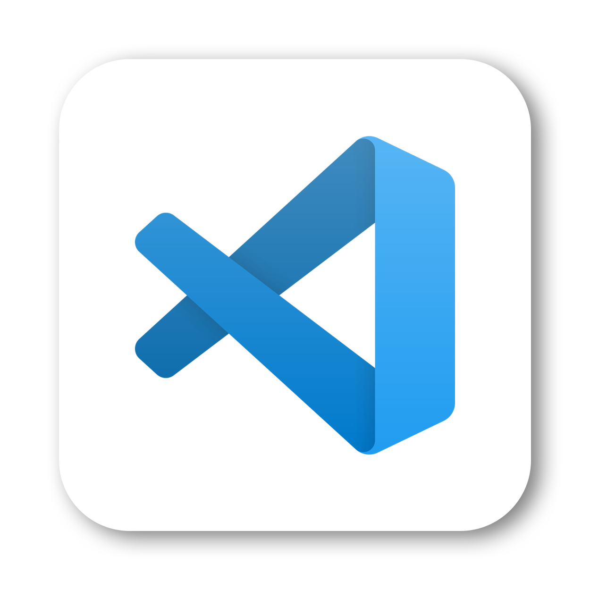
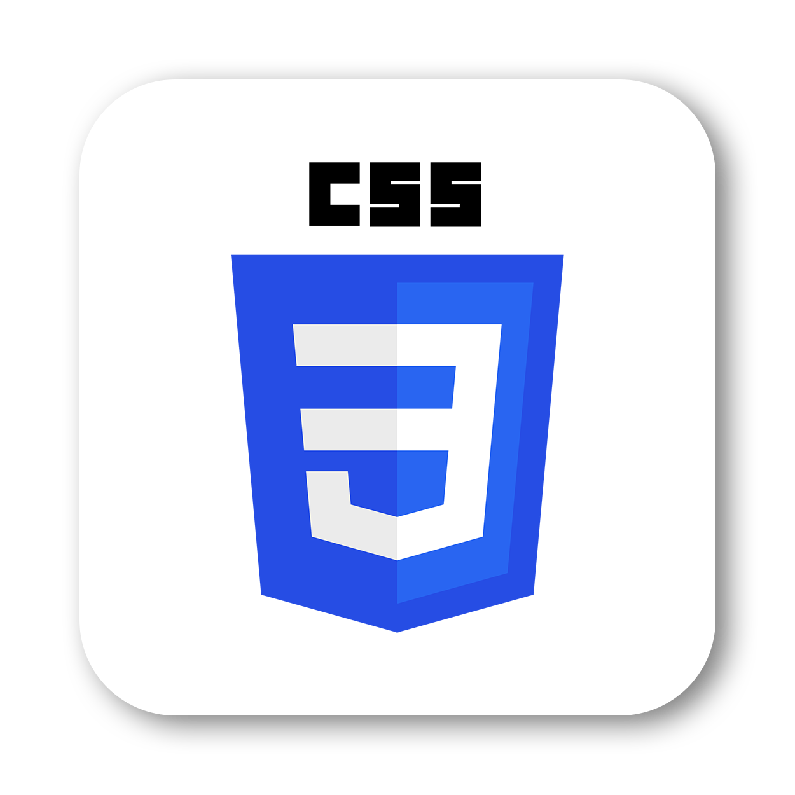

# design bootcamp

The design bootcamp is an online petition where visitors can sign to make their voice heard and vote for a new form of development to get extraordinary skills within the design field. It is a fully education program of 12 intense weeks in user experience and interface design. Participants will explore the professional areas of apps, websites, web design, software as well as other special gadgets you need today. After the program you will be able to create you own design concepts, create little products and put your creative ideas into action by designing interactive prototypes.

Check out the 👉 [design bootcamp](https://design-bootcamp.herokuapp.com)

The project was made at the [SPICED Academy](https://www.spiced-academy.com/de) within my Full Stack Web Development Bootcamp (Nov. '21 to Feb. '22)

---

## Features

-   register as new user
-   log in and log out as already registered user
-   the password security is provided by hashing it with bcrypt protection; the input is displayed encrypted
-   error handeling for mandatory fields
-   create and update the individual profile with additional information about the user, like age, city or homepage
-   vote for the design bootcampt by signing
-   delete and redo the signature
-   read more about the online petition in a faq section
-   see a list of other signers, ordered by their last name
-   sort the list of signers by city (provided the city is given)
-   check out the websites of others users by clicking on the link
-   special cursor styling for all the links and buttons
-   additional self-made and embedded logo as well as an info graphic at the start page
-   adjusted favicons for light and dark scheme

---

## Technology

---

<!-- ## Design library -->

<!-- ## Preview -->

## Routes

### /about

By visiting the online plattform for the first time users will be redirected to an `/about` page where they will find general information that explains the issue and the context of the design bootcamp. There are two CTA buttons: the first one links to `/petition` page where to sign (provided the user is logged in); if the user is not logged in yet he will be redirected to the `/register` page. The second button links to the `/faq` page to read more about the design bootcamp.

---

### /register

The `/register` page renders a form to register for the online petition and create a new profile in the database. If the visitor has already registered he can easily get to the `/login` page by clicking the CTA button below. The password will be hashed with bcrypt so that a very high-level data protection is provided.

---

### /profile

When the users registers for the first time, he will be redirected to a `/profile` page where he can add additional information like age, city or homepage. Alle these fields are not mandatory and can be updated in the `/profile/edit` page again.

---

### /login

The `/login` page is similar to the `/register` page; with a form that needs email and password to login.

---

### /petition

On the `/petition` the user can sign for the petition. If he has more questions before signing there is a linked button to the `/faq` site. In case the user has already signed, he will be redirected to the `/thanks`page.

---

### /thanks

When successfully signed for the design bootcamp, the user gets to the `/thanks` page where he can see his own signature, delete it again or get to the list of other signers.

---

### /signers

On the `/signers` page are all signers listed who have already voted for the petition; by their name. If additionally information are given – like their age, city and homepage – they are also shown. The cities are linked. When these links are clicked, the user will get to a new page showing only the people who have signed the petition that live in that city.

---

### /profile/edit

Here can personal information be edited; like the name, email adress, age, city or homepage.

---

### /faq

The `/faq` page answers some general questions about the design bootcamp itself, the duration, costs and curriculum as well as how to apply.

---

**© 2022, Michèle Rietzl**

<!--

High Level Description:
This project is an online petition where users can register or – if already registered – login, create, view and edit their own account, sign for a specific topic, view other signers and delete their signature again.

[first try]
The design bootcamp is an online petition where users can register, log in, create and update a profile, vote for a specific topic by signing, update their signature, read more on a faq section or see the list of other supporters.

Website:
https://design-bootcamp.herokuapp.com/

Tags:
- design
- express
- handlebars
- heroku
- login
- nodejs
- jest
- petition
- postregresql
- profile
- register
- spicedacademy
- testing

-->
